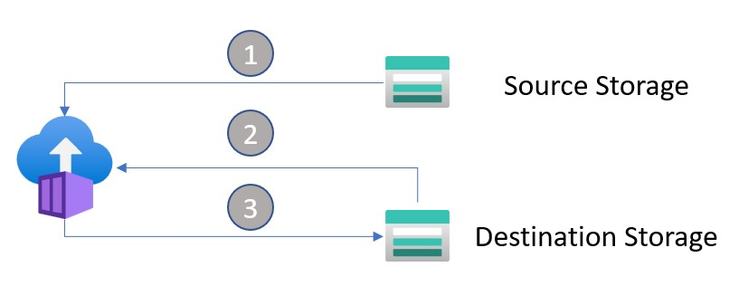

# Data Movement

[Return to main documentation](../README.md)

The data movement itself occurs using the azcopy tool and can be run as a standalone application locally, or within Azure Container Instances for longer running moves. 

The main application entrypoint is the executemove.py file. See [the setup steps](./repo_layout.md#steps) on how to prepare to run it. 

Each process, in the image below depicted as an ACI instance, uses the configuration it's given (not depicted in the image but can be found [here](./repo_layout.md#configini-description)).

|Step|Description|
|----|----|
|1|Scan the source storage for items to move. For each item acquire the SAS token-ized URL of the file.|
|2|Generate a SAS token-ized URL for the file to be created in destination storage.|
|3|Execute azcopy with the source and destination URL's created in 1 and 2|

[Return to main documentation](../README.md)