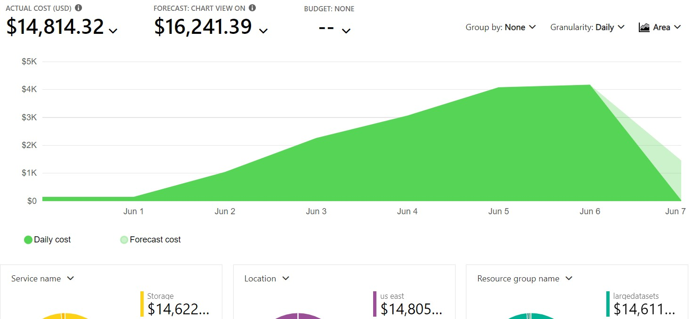

# Learnings

[Return to main documentation](../README.md#additional-documents)

The fastest movement of data is between two storage accounts within the same subscription and within the same region. The most important part of that configuration is that both storage accounts are located in the same region. 

However, performance drops off significantly if the storage accounts are of the premium sku, so stick with a standard sku.

Azure File Shares are generally too small for the task at hand, even with the premium SKU. However, if the data to move in really is only 5TiB, perhaps it's not an issue as the time to move it will still be fairly quick. 

Getting data into Azure is likely going to be the biggest problem as there are really two choices. Upload over a network or using Azure Databox. 

- [Azure Storage Services](#azure-storage-services)
- [azcopy](#azcopy)
- [Azure Databox](#azure-databox)
- [Data Movement Costs](#data-movement-costs)

## Azure Storage Services

Azure Storage, S3 and Azure Stack Storage can be used as sources for the azcopy utility so data must reside in one of these services. 

In the course of testing, it was learned that ADLS Gen2 is built on Azure Storage, so it likely too is a target for azcopy if the original dataset is too large (>5PiB) to fit into a single storage account.

- [Azure Storage File Shares](https://docs.microsoft.com/en-us/azure/storage/files/storage-files-scale-targets) are limited in size to 5TiB for standard services and can be upgraded to 100TiB for premium deployments. 

- [Azure Storage Blob Storage](https://docs.microsoft.com/en-us/azure/storage/common/scalability-targets-standard-account) has a limit of 5PiB which would be the appropriate source and destination service type for large dataset movment within Azure. 

## azcopy

The azcopy tool is incredibly fast at moving data. However it is limited, like all things cloud, by the network on which it is being run from. 

According to the product team themselves, there are no limits on the number of azcopy utilities running against your storage account BUT you are limited by the throughput as can be found in the observations. 

In the Azure eco-system, running copies cross region was painfully slow compared to in-region, so in-region moves are suggested whenever possible. 

## Azure Databox

Databox is a service in which hardware is sent out to a subscription owner to load up with data. However, the person who orders it:

- Must be the subscription owner
- Must have a storage account pre-created to load 

This *may* be a limitation with OSDU itself which currently does not allow attaching an existing account to it's data stores. Further, the account that backs the OSDU instance is in a managed group that may or may not be owned by the subscription owner that orders the Databox. 

However, Databox would likely be a faster option for a multi-petabyte move to Azure as the only other option would be to move it over the network. 

Estimates, assuming a solid and uninterrupted network connection, would be about 15-20 days per petabyte transfer. However, this was not tested by this developer.  

## Data Movement Costs

Costs are going to be a significant consideration when moving the data to Azure, however, moving data within Azure is also a consideration.

Between June 1 and June 6 the Petabyte scale testing occured. Over that 5 day period approximately 4PB of data was moved, but the costs need some investigation:

[Return to main documentation](../README.md#additional-documents)
