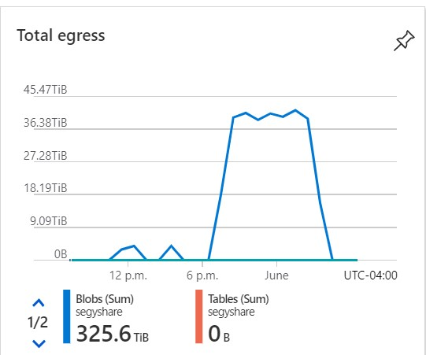
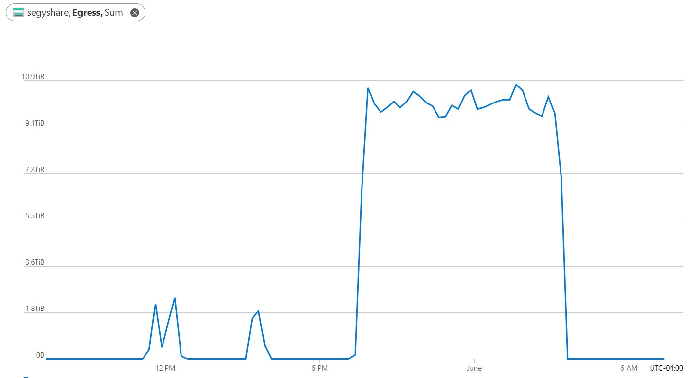
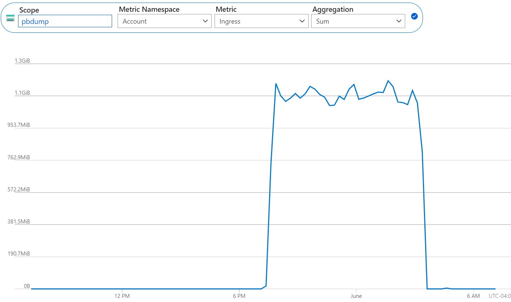

# Bulk Ingress/Egress

[Return to observations](./observations.md)

Attempted to move approximately 1PB of data using

- 10 ACI instances with azcopy as the core movement
- 1000, 100.99GB files each container

After several hours and approximately 325TB later, the process came to a crashing halt. 

- Initially thought it was a problem with the SAS but couldn't tell because of logging. 
- Updated logging and tried again with same result. 
- Updated SAS tokens but got the same result.
- Got a blob URL and generated a fresh SAS token and used the browser, same result. 

## Error
When using a full SAS tokenized URL, this is the error returned, which doesn't make sense because the storage account DID generate the SAS token. 

This indicates that something else in the background is broken or a limit was reached. 

```xml
<Error>
<Code>AuthenticationFailed</Code>
<Message>Server failed to authenticate the request. Make sure the value of Authorization header is formed correctly including the signature. RequestId:eeef7192-001e-0000-57a0-75692e000000 Time:2022-06-01T10:14:25.8670350Z</Message>
<AuthenticationErrorDetail>Signature did not match. String to sign used was segyshare rwdlacupitfx bfqt co 2022-06-01T10:14:15Z 2022-06-01T18:14:15Z https 2021-06-08 </AuthenticationErrorDetail>
</Error>
```

## Egress Classic (Source)


## Egress (Source)


## Ingress (Destination)


[Return to observations](./observations.md)
